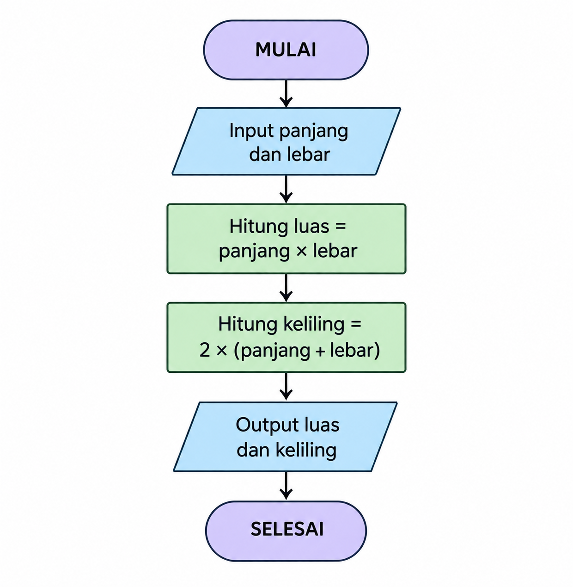

# Agnia Ul Auliyah_Algoritma_Pemograman
Tugas Algortma Pemograman 
## MENENTUKAN LUAS DAN KELILING PERSEGI PANJANG

## A. Deskripsi Masalah

Program ini dibuat untuk menghitung luas dan keliling persegi panjang menggunakan bahasa pemrograman Python.

Pengguna memasukkan nilai panjang dan lebar persegi panjang sebagai input. Selanjutnya, program menghitung luas menggunakan rumus:

L = p × l

dan keliling menggunakan rumus:

K = 2 × (p + l)

Hasil yang ditampilkan berupa nilai luas dan keliling persegi panjang.

# A. Identifikasi Input-Proses-Output

| Komponen | Keterangan |
|---|---|
| **Input** | Panjang dan lebar persegi panjang |
| **Proses** | Menghitung luas dengan rumus `L = p × l` dan keliling dengan rumus `K = 2 × (p + l)` |
| **Output** | Nilai luas dan keliling persegi panjang |

# B. Pseudocode

```text
ALGORITMA Menghitung Luas dan Keliling Persegi Panjang

MULAI

INPUT panjang
INPUT lebar

luas ← panjang × lebar
keliling ← 2 × (panjang + lebar)

OUTPUT luas
OUTPUT keliling

SELESAI
````
## D. Flowchart



## E. Implementasi Python

Program dibuat menggunakan bahasa pemrograman Python untuk menghitung luas dan keliling persegi panjang.

```python
# Program Menghitung Luas dan Keliling Persegi Panjang

panjang = float(input("Masukkan panjang persegi panjang: "))
lebar = float(input("Masukkan lebar persegi panjang: "))

luas = panjang * lebar
keliling = 2 * (panjang + lebar)

print("Luas persegi panjang:", luas, "cm²")
print("Keliling persegi panjang:", keliling, "cm")

````
## E. Implementasi Python

Program dibuat menggunakan bahasa pemrograman Python untuk menghitung luas dan keliling persegi panjang.
## E. Implementasi Python

Program dibuat menggunakan bahasa pemrograman Python untuk menghitung luas dan keliling persegi panjang.

```python
# Program Menghitung Luas dan Keliling Persegi Panjang

panjang = float(input("Masukkan panjang persegi panjang: "))
lebar = float(input("Masukkan lebar persegi panjang: "))

luas = panjang * lebar
keliling = 2 * (panjang + lebar)

print("Luas persegi panjang:", luas, "cm²")
print("Keliling persegi panjang:", keliling, "cm")
```

### Hasil yang diharapkan

```text
Luas persegi panjang: 50 cm²
Keliling persegi panjang: 30 cm
```

## F. Test Case

### Test Case 2

**Input:**
```text
Panjang = 12 cm
Lebar = 8 cm
```

**Hasil yang diharapkan:**
```text
Luas persegi panjang: 96 cm²
Keliling persegi panjang: 40 cm
```
## H. Tabel Pengujian

| Test Case | Input | Hasil yang Diharapkan | Hasil Pengujian |
|---|---|---|---|
| 1 | Panjang = 10 cm, Lebar = 5 cm | Luas = 50 cm², Keliling = 30 cm | Berhasil |
| 2 | Panjang = 12 cm, Lebar = 8 cm | Luas = 96 cm², Keliling = 40 cm | Berhasil |

## I. Hasil Pengujian

Berdasarkan pengujian yang telah dilakukan, program berhasil menghitung luas dan keliling persegi panjang dengan benar.

Pada Test Case 1, dengan panjang 10 cm dan lebar 5 cm, diperoleh luas 50 cm² dan keliling 30 cm.

Pada Test Case 2, dengan panjang 12 cm dan lebar 8 cm, diperoleh luas 96 cm² dan keliling 40 cm.

Hasil pengujian sesuai dengan perhitungan manual, sehingga program dapat berjalan dengan baik.

## I. Hasil Pengujian

Berdasarkan pengujian yang telah dilakukan, program berhasil menghitung luas dan keliling persegi panjang dengan benar.

- **Test Case 1:** Panjang = 10 cm, Lebar = 5 cm → Luas = 50 cm² dan Keliling = 30 cm.
- **Test Case 2:** Panjang = 12 cm, Lebar = 8 cm → Luas = 96 cm² dan Keliling = 40 cm.

Hasil yang diperoleh sesuai dengan perhitungan manual, sehingga program dapat berjalan dengan baik.
